# Typo feature
## Title
```markdown
# Title 1
## Title 2
### Title 3
#### Title 4
##### Title 5
###### Title 6
```
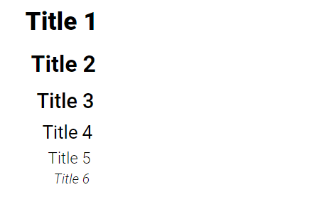

---

<br/>

## List
```markdown
- a
+ b
* c
```
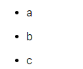

---

<br/>

## SubList
```markdown
- a
+ b
* c
    - c1
    + c2
    * c3
```
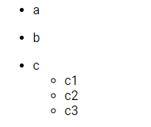

---

<br/>

## Ordered list
```markdown
1. A
1. B
1. C
    1. C1
    1. C2
    1. C3
1. D
```
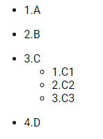

---

<br/>

## Horizontal rule
```markdown
---
```


---

<br/>

## Bold
```markdown
**bold text**
```
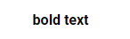

---

<br/>

## Italic
```markdown
*italic text*
```
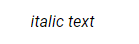

---

<br/>

## Strikethrough
```markdown
~~strikethrough~~
```


---

<br/>

## Link
```markdown
[Link](http://google.com)
```
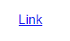

---

<br/>

## Image
```markdown

```


### Options
In a JSON Object, you can override the following options:

|Name|Type|Example|Description|
|---|---|---|---|
|showLegend|boolean|true|Boolean to know if you want to show or hide the legend of the image|
|width|string|80px|To define the width of the image|
|height|string|90px|To define the height of the image|
|class|string|css_class|Define which CSS style class must be added to your image|
|table_of_content|integer|1|Between 1 to 6. Define the title level to your image in the table of content. The title use will be the legend.|

*example*
```markdown

```


---

<br/>

## Paragraph
```markdown
First Paragraph

Second Paragraph
```
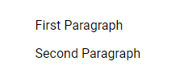

---

<br/>

## Array
```markdown
|A|B|
|---|---|
|1|2|
|3|4|
```
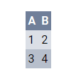

---

<br/>

## Bloc of code
```markdown
```javascript
var test = "yolo";
```
```
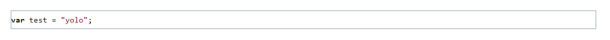

---

<br/>

## Task list
```markdown
- [ ] Task 1
- [ ] Task 2
- [x] Task 3
```
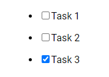

---

<br/>

## Definitions
```markdown
Definition
: a
: b
```
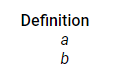

---

<br/>

## Blockquote
### Normal
```markdown
> Normal
```
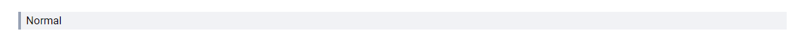
### Info
```markdown
> **[INFO]**
> Info
```
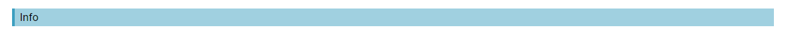
### Warning
```markdown
> **[WARNING]**
> Warning
```
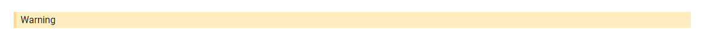
### Error 
```markdown
> **[ALERT]**
> Alert
```
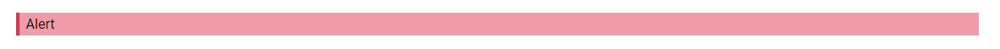
